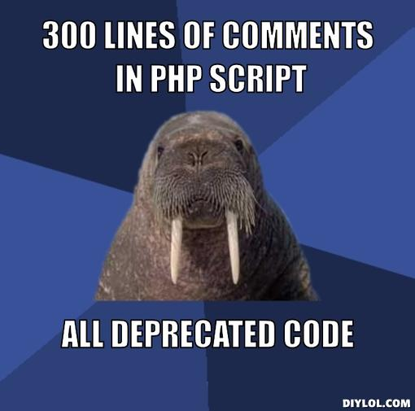

# lecture02

!SLIDE

# Lesson 02: Down the Haskell's hole

## Yet another way to introduce the basic syntax

### alfredod@cakesolutions.net

!SLIDE

## Haskell syntax for the Scala hacker

* Haskell syntax is clean and almost clutter free, so it doesn't
  take long to master
* We must only be sure to make really clear some fundamental differences
  with Scala

